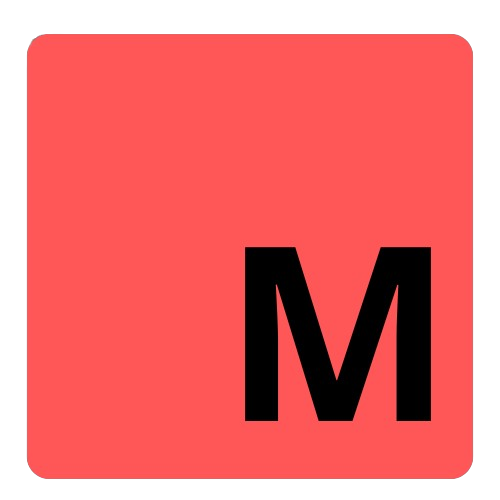

# 🪐 Mercury Programming Language


<p align="center">
  
</p>

---

**MercuryLang** is a lightweight, free, and open-source programming language written in **C++**, inspired by the simplicity of **Lua** and **Python**. It provides clean syntax, dynamic typing, powerful standard libraries, and a fast interpreter — ideal for beginners and language creators alike.

---

## 🚀 Features

- 🔹 Python-like clean syntax
- 🔹 First-class functions
- 🔹 Built-in math & list support
- 🔹 Dynamic variables and control flow
- 🔹 Interactive REPL + `.mer` file runner
- 🔹 C++ API to embed or customize MercuryLang

---

## 📦 Download

👉 [Download MercuryLang (.exe for Windows)](https://github.com/dinhsonhai132/MercuryLang-download/raw/refs/heads/main/MercuryLang-init.exe)

✅ Or you can go to this website https://dinhsonhai132.github.io/main.html to see more useful information 

---

## ⚙️ Getting Started

### Prerequisites

- C++ Compiler (MSVC / GCC / Clang)
- [CMake](https://cmake.org/) 3.12+

### Running Mercury

```bash
mercury           # Launch REPL
mercury main.mer  # Run file
```

---

## 🧠 Syntax Guide

### 📤 Output
```mer
import "IO"

print("hello world")
```

### 🔢 Variables
```mer
let x = 10
x += 1
```

### 📋 Lists
```mer
import "IO"

let fruits = ["apple", "banana"]
print(fruits[0])
```

### 🧠 Lambda
```mer
import "IO"

let f(x) = x * 2
print(f(3))
```

### 🧮 Math & Logic
```mer
import "math.mer"
import "IO"

let x = pi
print(cos(x) + sin(x))
print(power(x, 20))
print(isdigit(x))
print(factorial(x))
print(sqrt(x))
print(eval("1 + 1")) # support "+" and "-" only

let a = (2 + 1) / 2
let b = 3
print(a < b and b != 0)
```

### 🧠 Functions
```mer
func add(x, y) do
    return x + y
end

add(2, 3)
```

### 🔀 Control Flow
```mer
import "IO"

if (1 == 1 or 2 == 2) and 2 == 2 then
    print(true)
end

else
    print(false)
end

while x < 10 do
    x += 1
    continue
end

for i in range(0, 5) do
    print(i)
end

loop
    if x == 10 then break end
    x += 1
end
```

---

## 🧬 Embedding MercuryLang in C++

```cpp
#include <Mercury.h>

int main() {
    let_S   = "gan";
    PRINT_S = "in";
    WHILE_S = "lap";
    IF_S    = "neu";
    THEN_S  = "thi";
    END_S   = "ketthuc";

    LANGUAGE = "MercuryLangTiengViet";
    AUTHOR   = "Dinh Son Hai";

    prompt();
}
```
